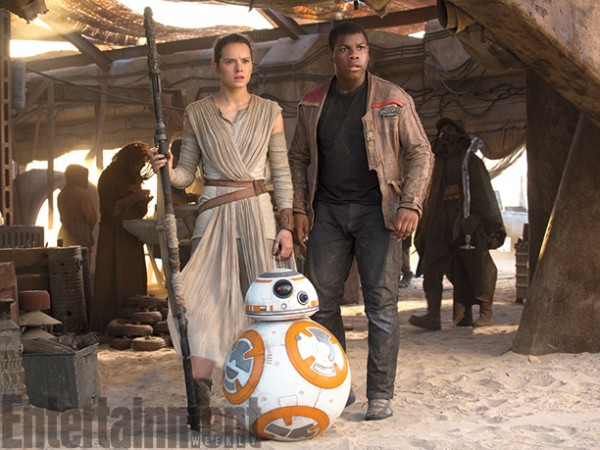
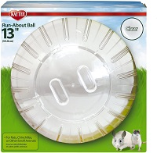
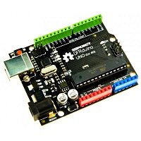
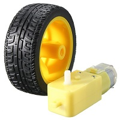
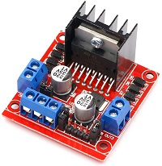
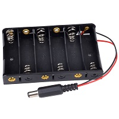
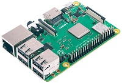

# BB8
2/3 scale BB8 robot as seen in Star Wars: The Force Awakens. 

_Note: This project is still in progress._

There are two major parts:
1) The hamster ball with an Arduiono controlled buggy inside
2) The head with a Raspberry Pi control unit. The Raspberry Pi control is optional if you don't want an autonomous/smart bot.

Planned features for final BB8:
* Choice between joystick control or semi-autonomous motion
* Raspberry Pi with pi camera will detect human shapes and instruct bot to follow first one it sees
* Raspberry Pi will access a home assistant API and give real answers to questions. API output will be translated to morse code with pitch and frequency modulations to make it really sound like BB8.

## Parts List

### Parts for Base

* 13" Hamster Ball

* Arduino Uno

* 4 wheels and 2 DC motors

* L298N Motor driver board or similar

* 9V Battery pack for 6 AA batteries

* At least four small neodymium magnets

### Parts for Head

* Raspberry Pi 3B+

## Build steps

### Physical Build Steps

### Electronics Build Steps
I followed the intructions here: https://www.teachmemicro.com/use-l298n-motor-driver/

### Programming Steps
